EC2 + NGINX + APPLICATION LOAD BALANCER (ALB)

membuat 1 EC2 web server (Nginx).
Lalu membuat Application Load Balancer (ALB) di depannya.
Target Group dipakai sebagai “daftar server tujuan”.
ALB menerima traffic dari internet → meneruskan ke EC2.
Akses web HARUS lewat DNS ALB, bukan IP EC2.
🌍 Internet
|
🚪 ALB (satpam depan)
|
📋 Target Group (daftar karyawan)
|
🏢 EC2 (web server nginx)

Alur Logika
Create Security Group
→ Create EC2 + install nginx
→ Create Target Group
→ Create ALB
→ Attach ALB to Target Group
→ Register EC2 ke Target Group
→ Akses via DNS ALB
Membuat security group
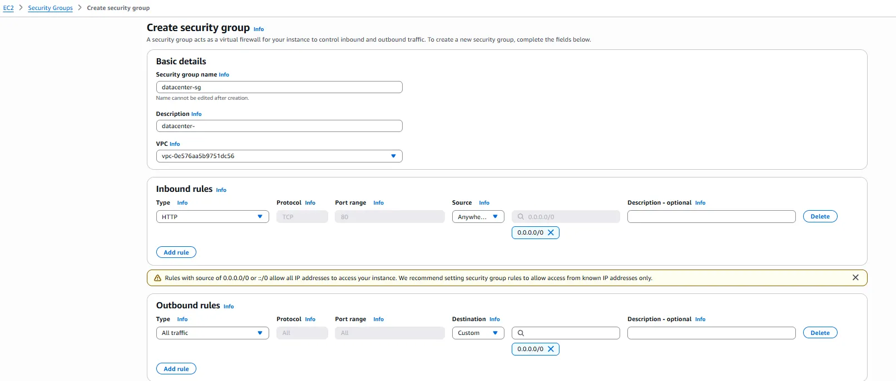
Press enter or click to view image in full size

2. Create EC2 (datacenter-ec2)

Network & Security
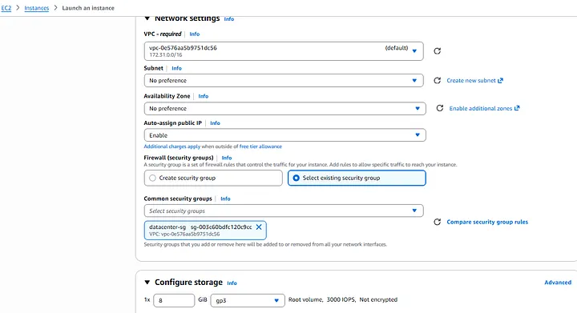
Press enter or click to view image in full size

User Data Script
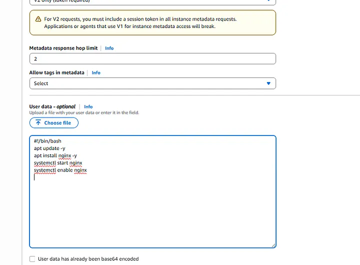
Press enter or click to view image in full size

3. Step 3 — Create Target Group
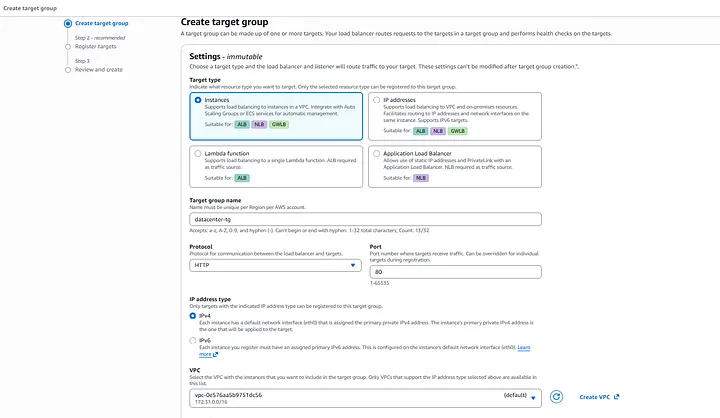
Press enter or click to view image in full size

Register Target

Tambahkan:

datacenter-ec2
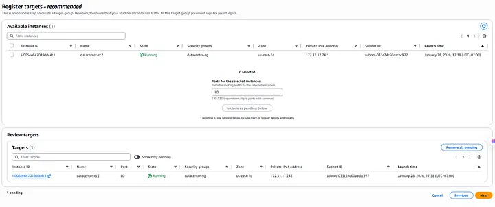
Press enter or click to view image in full size

4. Create Application Load Balancer
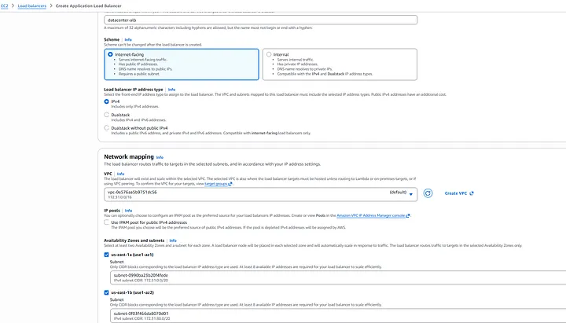
Press enter or click to view image in full size

Listener
HTTP : 80 → Forward to datacenter-tg
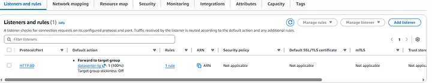
Press enter or click to view image in full size

5. Security Group Final Check

Security Group ALB

Inbound: HTTP 80 from 0.0.0.0/0
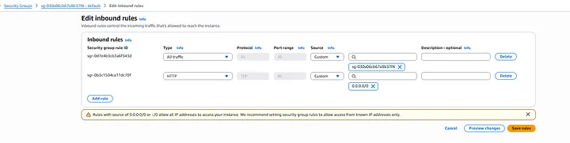
Press enter or click to view image in full size

Security Group EC2
Inbound: HTTP 80 from ALB security group
⚠️ BEST PRACTICE:

Jangan buka EC2 ke 0.0.0.0/0
Cukup dari ALB saja
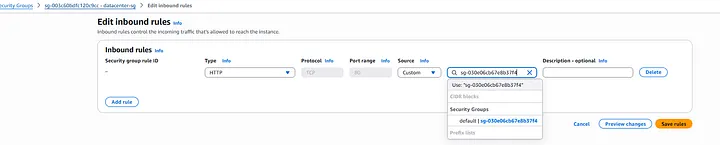
Press enter or click to view image in full size

6. Verifikasi (FINAL TEST)

A. Ambil ALB DNS

EC2 → Load Balancers → datacenter-alb
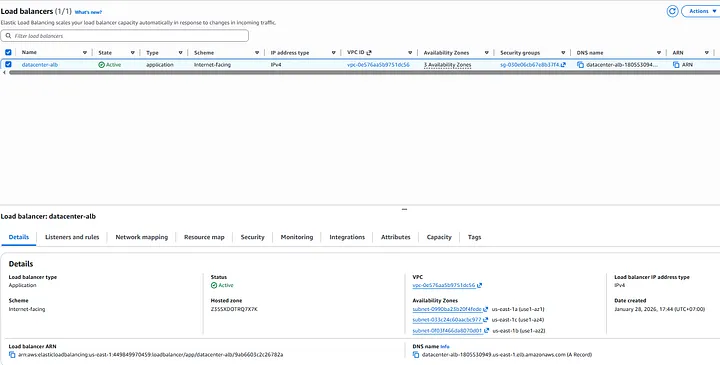
Press enter or click to view image in full size

muncul:

Welcome to nginx!
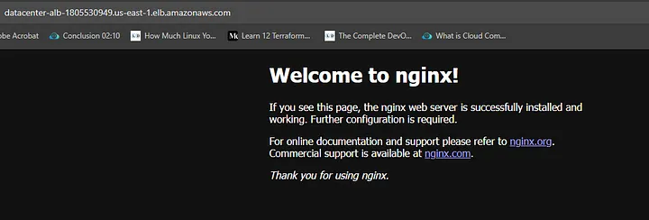
Press enter or click to view image in full size

Di production, user TIDAK PERNAH akses EC2 langsung.
Semua lewat Load Balancer